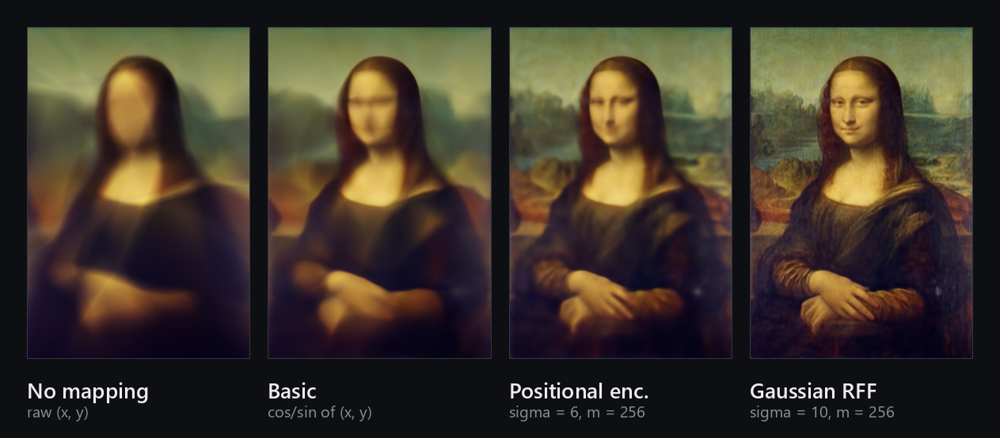

# fourier-features



A from-scratch reimplementation of the input mappings from
[*Fourier Features Let Networks Learn High Frequency Functions in Low Dimensional Domains*](https://arxiv.org/abs/2006.10739)
(Tancik et al., 2020), run head-to-head on the same image regression task.

Four identical 4-layer ReLU MLPs learn to map a pixel coordinate `(x, y)` to its colour. The
only thing that differs between them is what the coordinate is turned into before it reaches
the first layer. The banner is the result — same network, same data, same 1000 steps.

## The mappings

| | input to the MLP | width |
|---|---|---|
| **No mapping** | raw `(x, y)` | 2 |
| **Basic** | `[cos 2πv, sin 2πv]` | 4 |
| **Positional encoding** | `[cos 2πσ^(j/m) v, sin 2πσ^(j/m) v]` for `j = 0..m-1` | 1024 |
| **Gaussian RFF** | `[cos 2πBv, sin 2πBv]`, `B ~ N(0, σ²)` | 512 |

`general()` is included but never called — it's the paper's general form
`γ(v) = [a_j cos 2πb_jᵀv, a_j sin 2πb_jᵀv]`, kept so the other three can be read as
special cases of it. The functions are lifted slightly from the paper's presentation so they
accept a whole batch of coordinates at once and take `a`/`b` as arguments rather than fixing
them.

## Result

Without a mapping, the network cannot represent the high frequencies at all and settles into a
smear — a coordinate MLP's neural tangent kernel falls off too fast for fine detail. Basic
`cos/sin` barely helps. Positional encoding recovers the face. The Gaussian random features
recover the craquelure.

Hyperparameters come from the paper (`σ = 6` positional, `σ = 10` Gaussian, `m = 256`, page 19)
for the natural-images sweep. **The sweep was not re-run here**, so these are the paper's
optima for their dataset, not necessarily for this one image.

## Scope

This reproduces the *mappings* and demonstrates the effect. It is not a reproduction of the
paper's experiments — no NTK analysis, no held-out test error, no sweep, one image, no seeds
fixed across runs.

## Running it

Written on Kaggle with a GPU, so the paths in the notebook point at `/kaggle/`. To run it
elsewhere, change `vid_dir` and the `read_image` path — `test.jpg` is the input image and is
in this repo.

```
pip install torch torchvision matplotlib
jupyter notebook 3FourierFeatures.ipynb
```

Each training loop writes one PNG per step so the fits can be strung into a video. That is
several hundred megabytes per run and is not committed — delete the `save_image` line if you
just want the final images.
